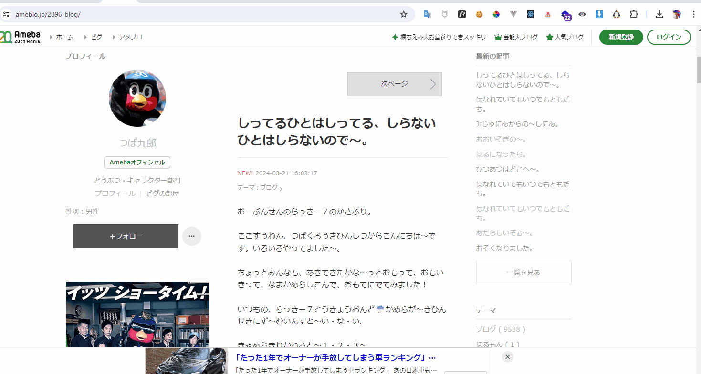

# kanji-2896


つば九郎の Ameba ブログにて、ひらがな文章を漢字変換する Chrome 拡張です。

## Usage

* 当プロジェクトをローカルに落とします。
```bash
git clone https://github.com/Ant2357/kanji-2896.git
```

* Chrome を開き 「拡張機能を管理」 -> 「パッケージ化されていない拡張機能を読み込む」から当プロジェクトを選択。

* これで導入完了です。
